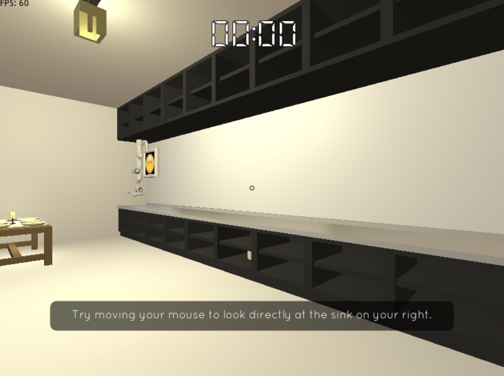

# Emobotics

An experimental study exploring how imbuing robots with perceived emotions influences human behavior. This project uses a **Godot** environment to measure changes in user interaction based on the robot's emotional state.

### 🎮 [Play the Demo](https://eugenood.github.io/emobotics/emobotics)

## Overview
* **Objective:** Test if human behavior shifts when robots exhibit emotional traits.
* **Environment:** Built with **Godot Engine** (GDScript) and exported for Web.
* **Deployment:** Integrated with **Amazon Mechanical Turk (MTurk)** for remote data collection and behavioral analysis.
